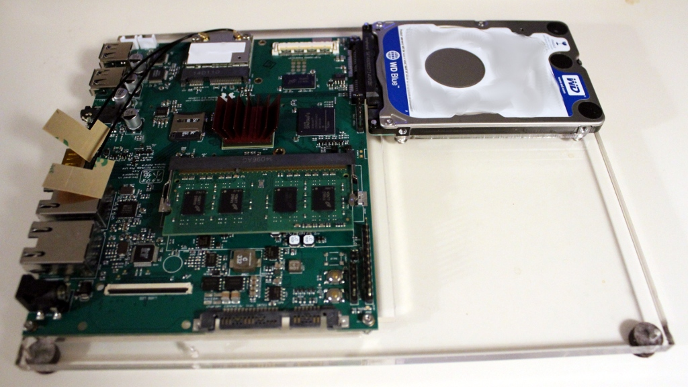

# SATA Slab Case

# Description
This is a minimalist development "case" to mount a Novena motherboard with a SATA drive securely attached.

# Notes
* Caveat Emptor
* Holes for mounting the board should be 2.5mm, currently 2mm screws are used

# Building
1. Laser cut [novena_hd_spacer.svg](Hard Drive Spacer) out of ~2mm thick acrylic
  [http://www.mcmaster.com/#8560K182](Optically Clear Cast Acrylic Sheet, 3/32" Thick, 12" x 24")

2. Laser cut [novena_mb_spacer.svg](Motherboard Spacer) from ~6.35mm thick acrylic
  [http://www.mcmaster.com/#8560K355](Optically Clear Cast Acrylic Sheet, 1/4" Thick, 12" x 24")

3. Screw together and add rubber/felt feet.
